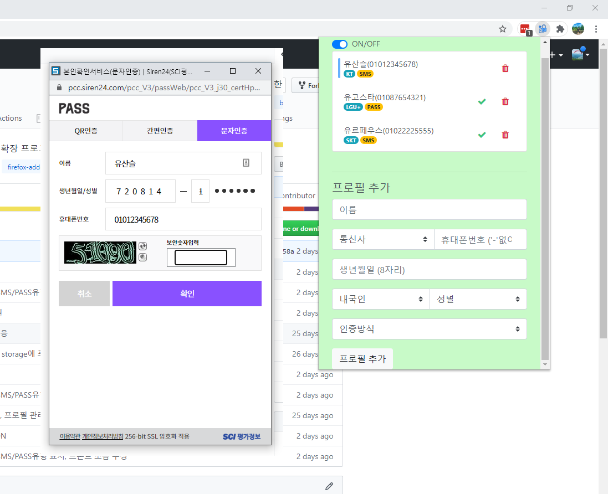
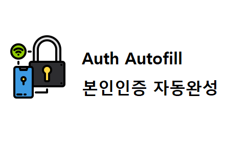

# 본인인증 자동완성 (Auth Autofill)
휴대전화 본인인증 자동완성 확장 프로그램

휴대폰인증하려면 인증 팝업창이 뜨고 최소 수번의 클릭과 입력이 필요한데 이를 아이디,패스워드 자동완성처럼 자동으로 미리 저장된 정보를 입력해주는 확장프로그램입니다.

이름, 휴대폰번호, 내외국인유무, 사용중인 통신사, 생년월일, 선호 인증방식(SMS인증, 통신사앱인증 등) 등을 미리 저장하여 자동완성 프로필을 생성해둔 뒤 휴대전화 인증을 진행할 때 사용자는 자동완성 프로필중 하나를 선택하거나 기본프로필로 자동완성되어 보안문자(CAPTCHA)만을 입력후 SMS인증번호를 입력함으로서 간편하게 이용할 수 있도록 도와주는 브라우저 확장 프로그램

이용자의 개인정보는 서버로 수집되지않으며, 브라우저 저장공간내에 안전하게 저장됩니다.

# 개발동기
한국은 2014년 주민등록번호 사용금지 조치로 법령상 근거없는 주민등록번호 수집이 금지되었습니다. 이에 기존까지 주민등록번호를 통해 본인인증하는 방식이 사라지고 공인인증서, 아이핀, 신용카드 인증방식 등이 나왔지만 가장 편리하고 보편적인 SMS인증이 자리잡았습니다. SMS인증에는 카카오톡 등과 같이 단순히 해당 번호를 사용하고 있다는 것을 인증하는 "번호 인증"이 있고, 휴대전화 가입자의 인적사항등을 입력하여 해당 인적사항의 사용자라는 것을 인증하는 "본인 인증"이 있습니다. 번호인증은 휴대폰번호만을 입력하면되는 반면 본인 인증은 이름,생년월일 등의 인적사항을 매번 똑같이 입력해야함은 물론 여러 페이지 프로세스로 나눠짐과 SMS대신 통신사 인증앱으로의 유도, 유료 월정액 유도(선택동의 클릭유도) 등 사용자경험을 해치는 UI를 가지고있습니다. 이를 해결하기 위해 브라우저에서 ID,PW자동완성과 같이 휴대전화 본인인증에 필요한 정보를 미리 입력해두면 자동으로 해당 내용을 입력해주는 기능을 브라우저 확장 프로그램으로 개발하였습니다.

# 기여
이 프로젝트에 관심이 있으신 경우, 직접 참여하여 프로젝트에 기여하실 수 있습니다. 개발 직접 참여 뿐만아니라 이용 후 피드백도 경청하여 듣겠습니다.

# 지원 본인인증 업체 목록
 * [정부24](https://www.gov.kr)
 * [가족관계등록시스템](https://efamily.scourt.go.kr)
 * [나이스신용평가정보](http://www.namecheck.co.kr)
 * [서울신용평가정보](http://www.seoulcredit.co.kr)
 * [코리아크레딧뷰로](http://ok-name.co.kr)
 * [드림시큐러티](http://www.mobile-ok.com)
 * [한국모바일인증](http://www.kmcert.com)
 * [한국사이버결제](http://www.kcp.co.kr)
 * [다날](https://www.danal.co.kr)
 * [네이버](https://nid.naver.com)

# 설치

[Chrome](https://chrome.google.com/webstore/detail/auth-autofill/picheccdgiofpnkjbkekgkcighblblem)

[Whale](https://store.whale.naver.com/detail/ncfnbaompehfhemgcpfkokcecnmohigo)

[Safari (macOS)](https://apps.apple.com/kr/app/본인인증-자동완성-for-safari/id1550426920)

[Firefox](https://addons.mozilla.org/ko/firefox/addon/auth-autofill/)

[Edge](https://microsoftedge.microsoft.com/addons/detail/본인인증-자동완성-auth-autofill/lifloelaookkeeajgkoobphhdkinfhlp?hl=ko)

[Opera](https://addons.opera.com/ko/extensions/details/bonininjeung-jadongwanseong-auth-autofill/)